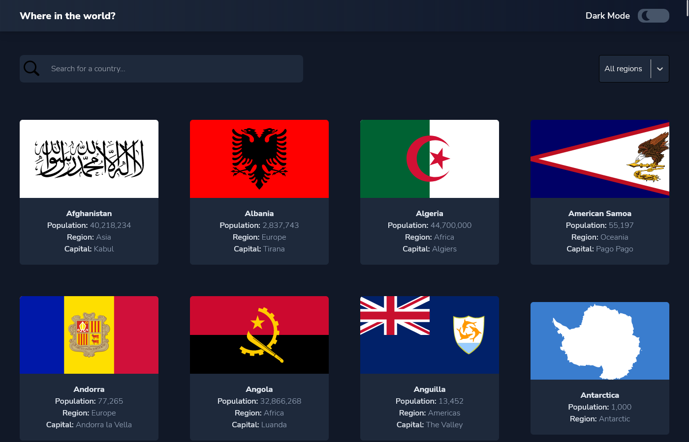
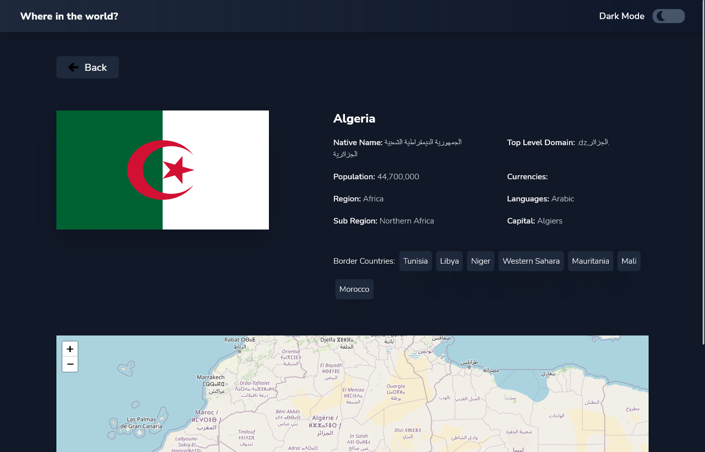

# Frontend Mentor - REST Countries API with color theme switcher

## Table of contents

- [Overview](#overview)
  - [Screenshot](#screenshot)
  - [Links](#links)
- [My process](#my-process)
  - [Built with](#built-with)
  - [Useful resources](#useful-resources)
- [Author](#author)

## Overview

### Screenshot

### Links

- Solution URL: (https://shadee404.github.io/countries-app/)
- Live Site URL: ()

## My process

### Built with

- Tailwind
- TypeScript
- React
- React router
- React select
- Leaflet

### Useful resources

- [React doc](https://reactjs.org/docs/getting-started.html)
- [Tailwind](https://tailwindcss.com/docs/installation)
- [Leaflet](https://leafletjs.com/)
- [React router tutorial for v6 ](https://reacttraining.com/blog/react-router-v6-pre/)
- [React course](https://scrimba.com/learn/learnreact)

## Author

- Frontend Mentor - [@Shadee404](https://www.frontendmentor.io/profile/Shadee404)
- Github - https://github.com/Shadee404
